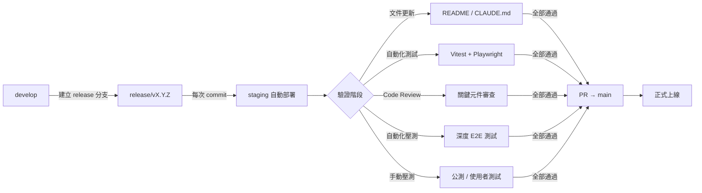

# Release 工作流程

> 本文件描述 Eternity 專案從開發到正式上線的完整 release 流程。

## 流程總覽

```
develop → release/vX.Y.Z → staging 自動部署 → 驗證 → main（正式機）
```



## 階段詳細說明

### 階段 0：準備 Release 分支

從 `develop` 建立 release 分支，命名規則：`release/vX.Y.Z`

```bash
git checkout develop
git checkout -b release/vX.Y.Z
git push origin release/vX.Y.Z
```

**注意：** 推送到 release 分支會觸發 staging 自動部署（與推送到 `staging` 分支效果相同）。

此階段需完成：
- [ ] `package.json` 版本號 bump
- [ ] 確認環境變數設定完整

### 階段 1：系統文件更新

更新所有面向開發者的文件，確保反映當前系統狀態。

#### 清單

| 文件 | 說明 | 更新方式 |
|------|------|----------|
| `README.md` | 英文版根目錄 README | 手動更新 |
| `README.zh-tw.md` | 繁體中文版 | 與英文版同步 |
| `apps/uep/README.md` | 文件站專屬說明 | 手動更新 |
| `.claude/CLAUDE.md` | AI 工作指引 | 確認反映新增功能 |

#### 更新重點

- 技術棧變更
- 新增的功能 / zone / 元件
- 新的開發指令（如測試指令）
- 開發狀態（已完成 / 進行中 / 計劃中）
- 部署架構變更

### 階段 2：自動化測試基礎設施

確保測試基礎設施完整且全部通過。

#### 三層測試架構

| 層級 | 工具 | 指令 | 說明 |
|------|------|------|------|
| 前端單元 | Vitest + jsdom | `pnpm test` | hooks、工具函式、元件邏輯 |
| Worker | Vitest + cloudflare pool | `pnpm test:workers` | D1 API、KV 操作、CORS |
| E2E 煙霧 | Playwright | `pnpm test:e2e` | 頁面載入、白屏防護、API 健康 |

```bash
# 一次全跑
pnpm test:all     # 單元 + Worker
pnpm test:e2e     # E2E（需要 dev server 在運行）
```

#### 新增測試的原則

- **P0 關鍵路徑優先**：首頁捲動、Zone 轉場、Reader 資料載入
- **回歸測試**：每次修 bug 都補一個對應的測試案例
- **Worker API**：每新增端點都補整合測試

### 階段 3：Code Review

由 reviewer 對關鍵元件進行系統性審查。

#### 審查範圍

- **P0 風險點**：首頁捲動狀態機、Zone boot 轉場、Reader 資料載入
- **資料一致性**：D1 API 的 CRUD 和同步邏輯
- **安全性**：Admin 認證 middleware、API token 驗證
- **效能**：大量資料的 tree 建構、圖片載入策略
- **行動裝置**：響應式佈局、觸控互動

#### 審查產出

- 問題清單（依嚴重度分級：P0 / P1 / P2）
- 修復建議
- 可選的重構建議（標記為「正式機後」）

### 階段 4：自動化壓力測試

用 Playwright 撰寫深度互動測試，模擬真實使用者行為。

#### 測試場景

| 場景 | 描述 |
|------|------|
| 首頁完整旅程 | 載入 → Lobby 動畫 → 向下捲動 → 進入各 Zone |
| Zone Reader 載入 | 進入 Zone → 等待 boot 動畫 → 展開內容 → 導航頁面 |
| 編輯器操作 | 開啟 Admin → 選擇區域 → 編輯內容 → 儲存 |
| 行動版互動 | 觸控捲動 → Zone 切換 → Reader 使用 |
| 極端情況 | 快速連續 Zone 切換、返回再前進、深層 deep link |

### 階段 5：手動壓力測試（公測）

開發者 / 測試者在 staging 環境親自操作，記錄問題。

#### 測試清單

```markdown
## 桌面版
- [ ] 首頁載入完整，Lobby 動畫正常
- [ ] 向下捲動：所有 Zone 進場動畫正常觸發
- [ ] 向上捲動：不會卡在任何位置
- [ ] 3D 地圖：點擊各 Zone 可正確導航
- [ ] 每個 Zone 的 Reader 可正常載入內容
- [ ] Admin 後台可登入、編輯、儲存
- [ ] 媒體庫可上傳、刪除圖片

## 行動版
- [ ] 首頁觸控捲動流暢
- [ ] Zone 切換不卡頓
- [ ] Reader 內容正常顯示
- [ ] 文字不溢出、圖片不超框

## 效能
- [ ] 首次載入 < 3 秒（Desktop LTE）
- [ ] Zone 切換轉場 < 1 秒
- [ ] Reader 內容載入 < 2 秒

## 邊界情況
- [ ] 重新整理任何頁面不會白屏
- [ ] Deep link 直接進入 Zone 頁面可正常載入
- [ ] 瀏覽器返回/前進按鈕行為正確
```

### 階段 6：修復與收斂

根據 Code Review + 自動化測試 + 手動測試的結果，修復所有問題。

#### 優先順序

1. **P0（阻塞上線）**：白屏、資料遺失、安全漏洞
2. **P1（必須修復）**：互動中斷、動畫故障、行動版嚴重排版問題
3. **P2（應該修復）**：文案錯字、微小的樣式不一致、非關鍵路徑的 bug
4. **標記為「正式機後」**：可改善但不影響上線的項目

#### 修復流程

每次修復都在 release 分支上進行：

```bash
# 修復 → commit → 自動部署 staging → 驗證
git add .
git commit -m "fix: 修復首頁捲動卡死問題"
# staging 自動更新，去 staging URL 驗證
```

### 階段 7：合併到 main

所有問題修復完畢、測試全通過後：

```bash
# 確認所有測試通過
pnpm check
pnpm test:all
pnpm test:e2e

# 建立 PR: release/vX.Y.Z → main
# PR 通過後合併，觸發正式部署
```

## 分支清理

合併後清理：

```bash
git branch -d release/vX.Y.Z
git push origin --delete release/vX.Y.Z
```

## 快速參考

```bash
# Release 階段常用指令
pnpm check                    # 全面品質檢查
pnpm test:all                 # 全部單元 + Worker 測試
pnpm test:e2e                 # E2E 煙霧測試
pnpm test:e2e --headed        # E2E 可視化模式
git push origin HEAD:staging  # 推送到 staging 預覽
```
